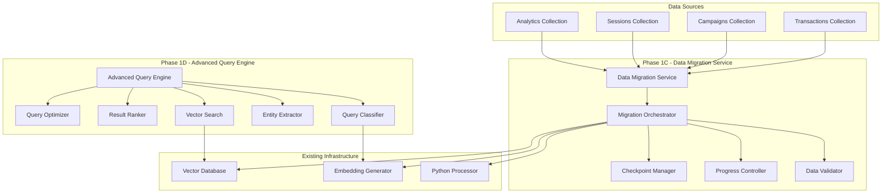

# Design Document

## Overview

This design document outlines the implementation of Phase 1C (Data Migration Service) and Phase 1D (Advanced Query Processing Engine) to complete the foundational infrastructure for CQ Intelligence's enhanced analytics platform. The design focuses on robust data migration capabilities and intelligent query processing with vector search integration.

## Architecture

### High-Level Architecture



### Component Integration

The migration service integrates with existing Phase 1A (Vector Database) and Phase 1B (Python Services) components, while the query engine provides the interface layer for intelligent data retrieval.

## Components and Interfaces

### Phase 1C: Data Migration Service

#### 1. Migration Orchestrator (`dataMigrationService.js`)

**Purpose:** Coordinates the entire migration process across different data types.

**Key Methods:**
- `initializeMigration(config)` - Initialize migration with configuration
- `startMigration(options)` - Begin migration process
- `pauseMigration()` - Pause ongoing migration
- `resumeMigration()` - Resume paused migration
- `getMigrationStatus()` - Get current migration status
- `validateMigration()` - Validate migration results

**Configuration Structure:**
```javascript
const migrationConfig = {
  sources: ['analytics', 'sessions', 'campaigns', 'transactions'],
  batchSize: 1000,
  maxConcurrency: 4,
  validationLevel: 'strict',
  backupOriginal: true,
  resumeFromCheckpoint: true,
  retryAttempts: 3,
  retryDelay: 5000
};
```

#### 2. Data Processors

**Analytics Data Processor:**
- Extracts analytics metrics and metadata
- Generates contextual embeddings for analytics data
- Preserves time-series relationships
- Handles aggregated statistics

**Session Data Processor:**
- Processes user journey information
- Maintains user-session relationships
- Extracts behavioral patterns
- Preserves device and browser metadata

**Campaign Data Processor:**
- Processes UTM and campaign data
- Maintains attribution relationships
- Extracts campaign performance metrics
- Preserves conversion tracking data

**Transaction Data Processor:**
- Processes blockchain transaction data
- Maintains wallet-transaction relationships
- Extracts Web3 interaction patterns
- Preserves smart contract metadata

#### 3. Progress Tracking System

**Real-time Progress Monitoring:**
```javascript
const progressSchema = {
  totalRecords: Number,
  processedRecords: Number,
  successfulRecords: Number,
  failedRecords: Number,
  currentPhase: String,
  estimatedCompletion: Date,
  processingRate: Number,
  errors: [String]
};
```

#### 4. Checkpoint Management

**Checkpoint Data Structure:**
```javascript
const checkpointSchema = {
  migrationId: String,
  timestamp: Date,
  completedSources: [String],
  currentSource: String,
  lastProcessedId: String,
  progress: Object,
  configuration: Object
};
```

### Phase 1D: Advanced Query Processing Engine

#### 1. Query Classification System

**Intent Classification:**
- Performance queries (metrics, KPIs)
- Trend analysis queries (time-series patterns)
- Attribution queries (campaign effectiveness)
- User behavior queries (journey analysis)
- Web3 queries (transaction patterns)

**Classification Algorithm:**
```javascript
const queryClassification = {
  intent: 'performance|trend|attribution|behavior|web3',
  confidence: 0.0-1.0,
  entities: {
    timeframe: 'last_7_days|last_month|custom',
    metrics: ['visitors', 'conversions', 'revenue'],
    filters: {
      siteId: String,
      campaignId: String,
      deviceType: String
    }
  }
};
```

#### 2. Entity Extraction Engine

**Temporal Entity Extraction:**
- Relative time expressions ("last week", "past month")
- Absolute date ranges ("January 2024")
- Comparative periods ("vs last year")

**Metric Entity Extraction:**
- Standard analytics metrics
- Custom KPI definitions
- Calculated metrics

**Filter Entity Extraction:**
- Dimensional filters (device, location, source)
- Behavioral filters (new vs returning users)
- Web3-specific filters (wallet type, transaction value)

#### 3. Vector Search Integration

**Multi-Stage Search Process:**
1. **Query Embedding Generation:** Convert natural language to vector
2. **Similarity Search:** Find relevant documents using vector similarity
3. **Metadata Filtering:** Apply extracted filters to results
4. **Hybrid Ranking:** Combine vector similarity with metadata relevance

**Search Strategy Selection:**
```javascript
const searchStrategies = {
  vector_only: 'Pure vector similarity search',
  hybrid: 'Vector + text search combination',
  filtered_vector: 'Vector search with metadata filters',
  semantic_search: 'Context-aware semantic search'
};
```

#### 4. Result Ranking and Explanation

**Ranking Factors:**
- Vector similarity score (40%)
- Metadata relevance (30%)
- Temporal relevance (20%)
- User context (10%)

**Explanation Generation:**
```javascript
const resultExplanation = {
  confidence: 0.85,
  reasoning: [
    'High vector similarity (0.92) to query intent',
    'Exact match on timeframe filter',
    'Relevant to specified site context'
  ],
  alternatives: ['Similar queries you might try'],
  completeness: 0.95
};
```

#### 5. Query Optimization

**Caching Strategy:**
- Query result caching with TTL
- Embedding caching for common queries
- Precomputed results for frequent patterns

**Performance Optimization:**
- Query rewriting for better performance
- Index hint utilization
- Parallel processing for complex queries

## Data Models

### Migration Data Models

#### Migration Job Schema
```javascript
const migrationJobSchema = {
  _id: ObjectId,
  jobId: String,
  status: 'pending|running|completed|failed|paused',
  configuration: Object,
  progress: {
    totalRecords: Number,
    processedRecords: Number,
    successfulRecords: Number,
    failedRecords: Number
  },
  startTime: Date,
  endTime: Date,
  errors: [String],
  checkpoints: [Object]
};
```

#### Vector Document Schema (Enhanced)
```javascript
const vectorDocumentSchema = {
  _id: ObjectId,
  documentId: String,
  sourceType: 'analytics|session|campaign|transaction',
  sourceId: ObjectId,
  siteId: String,
  teamId: String,
  embedding: [Number], // 1536 dimensions
  content: String,
  metadata: {
    title: String,
    category: String,
    importance: Number,
    timeframe: String,
    metrics: Object,
    relationships: [String]
  },
  migrationInfo: {
    migrationJobId: String,
    migratedAt: Date,
    sourceCollection: String,
    validationStatus: String
  },
  status: 'active|archived|deleted',
  createdAt: Date,
  updatedAt: Date
};
```

### Query Processing Data Models

#### Query Context Schema
```javascript
const queryContextSchema = {
  queryId: String,
  originalQuery: String,
  processedQuery: String,
  intent: {
    type: String,
    confidence: Number,
    subIntents: [String]
  },
  entities: {
    temporal: Object,
    metrics: [String],
    filters: Object,
    scope: Object
  },
  searchStrategy: String,
  userId: String,
  sessionId: String,
  timestamp: Date
};
```

#### Search Result Schema
```javascript
const searchResultSchema = {
  queryId: String,
  results: [{
    documentId: String,
    score: Number,
    confidence: Number,
    content: String,
    metadata: Object,
    explanation: {
      matchFactors: [String],
      relevanceScore: Number,
      reasoning: String
    }
  }],
  totalResults: Number,
  processingTime: Number,
  searchStrategy: String,
  cacheHit: Boolean
};
```

## Error Handling

### Migration Error Handling

**Error Categories:**
1. **Connection Errors:** Database connectivity issues
2. **Data Validation Errors:** Invalid or corrupted data
3. **Processing Errors:** Embedding generation failures
4. **Resource Errors:** Memory or disk space issues

**Error Recovery Strategies:**
- Automatic retry with exponential backoff
- Graceful degradation for non-critical errors
- Checkpoint-based recovery for major failures
- Manual intervention triggers for critical errors

### Query Processing Error Handling

**Error Scenarios:**
1. **Query Parsing Errors:** Malformed or ambiguous queries
2. **Search Errors:** Vector database connectivity issues
3. **Timeout Errors:** Long-running query timeouts
4. **Resource Errors:** High memory usage or rate limiting

**Error Response Strategy:**
```javascript
const errorResponse = {
  success: false,
  error: {
    code: 'QUERY_PARSING_ERROR',
    message: 'Unable to parse query intent',
    suggestions: ['Try rephrasing your query', 'Use more specific terms'],
    fallbackResults: [] // Best-effort results if available
  }
};
```

## Testing Strategy

### Migration Testing

**Unit Tests:**
- Individual data processor validation
- Checkpoint save/restore functionality
- Progress tracking accuracy
- Error handling scenarios

**Integration Tests:**
- End-to-end migration workflows
- Database connectivity and transactions
- Python service integration
- Vector database operations

**Performance Tests:**
- Large dataset migration performance
- Memory usage optimization
- Concurrent migration handling
- Recovery time measurement

### Query Engine Testing

**Unit Tests:**
- Query classification accuracy
- Entity extraction precision
- Search strategy selection
- Result ranking algorithms

**Integration Tests:**
- Vector database search integration
- Caching system functionality
- Multi-modal search capabilities
- Error handling workflows

**Performance Tests:**
- Query response time benchmarks
- Concurrent query handling
- Cache effectiveness measurement
- Memory usage optimization

### Test Data Requirements

**Migration Test Data:**
- Sample analytics data (1000+ records)
- Session data with user journeys
- Campaign data with attribution chains
- Transaction data with Web3 patterns

**Query Test Data:**
- Natural language query samples
- Expected intent classifications
- Benchmark search results
- Performance baseline metrics

## Security Considerations

### Data Migration Security

**Data Protection:**
- Encryption in transit during migration
- Backup data encryption at rest
- Access logging for migration operations
- Data anonymization for sensitive fields

**Access Control:**
- Role-based migration permissions
- API key authentication for services
- Audit logging for all operations
- Secure checkpoint storage

### Query Processing Security

**Query Security:**
- Input sanitization and validation
- Rate limiting for query endpoints
- User permission-based result filtering
- Audit logging for sensitive queries

**Data Access Security:**
- Row-level security for multi-tenant data
- Field-level permissions for sensitive data
- Query result anonymization
- Secure caching with encryption

## Performance Requirements

### Migration Performance

**Throughput Targets:**
- Process 1000+ records per minute
- Complete full migration within 2 hours
- Memory usage under 500MB during migration
- Database impact minimization during operation

**Scalability Requirements:**
- Handle datasets up to 1M records
- Support concurrent migration jobs
- Horizontal scaling capability
- Resource usage optimization

### Query Processing Performance

**Response Time Targets:**
- 95% of queries under 2 seconds
- 99% of queries under 5 seconds
- Cache hit ratio above 60%
- Concurrent query support (100+ simultaneous)

**Scalability Requirements:**
- Handle 1000+ queries per minute
- Support multiple concurrent users
- Auto-scaling based on load
- Efficient resource utilization

## Monitoring and Observability

### Migration Monitoring

**Key Metrics:**
- Migration progress percentage
- Processing rate (records/minute)
- Error rate and types
- Resource utilization (CPU, memory, disk)

**Alerting:**
- Migration failure alerts
- Performance degradation warnings
- Resource exhaustion notifications
- Data validation error alerts

### Query Processing Monitoring

**Key Metrics:**
- Query response times
- Search accuracy metrics
- Cache hit rates
- Error rates by query type

**Alerting:**
- Slow query alerts
- High error rate notifications
- Resource usage warnings
- Search quality degradation alerts